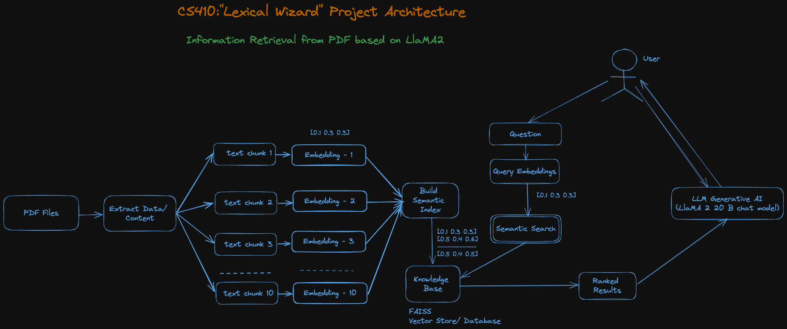
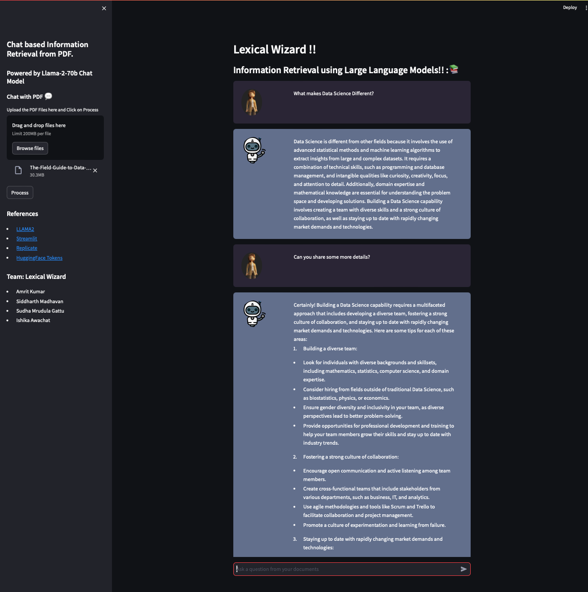

# Lexical Wizards
## _Your Streamlit Question-Answering App_
Lexical Wizard is a project designed to perform Information Retrieval from uploaded documents and provide real-time answers to custom user queries. The system utilizes advanced components such as PDFLoader, CharacterTextSplitter, HuggingFaceEmbeddings, FAISS (local in-memory Vector store), and the powerful LlaMA2 (Large Language Model with 7B parameters). Replicate is employed to invoke LLM models through API calls.

- Interact with the assistant in a chat interface
- Get answers based on the content of any PDF (eg. research paper)
- Easy-to-use, powered by LlaMA2 and a light weight UI using Streamlit

### Video
[](https://youtu.be/ektynyO3_Aw)

## Team Memebers
1. Amrit Kumar (Captain) - amritk2@illinois.edu
2. Gattu, Sudha Mrudula - sudhamg2@illinois.edu 
3. Ishika Awachat, Ishika - awachat2@illinois.edu 
4. Madhavan, Siddharth - sm120@illinois.edu 

## Features

- Import a PDF
- Ask questions related to the content
- Assistant provides answers using LangChain and Hugging Face models
- Chat interface for interactive user experience

## Tech Stack

Lexical Wizards uses several technologies:

- [LangChain](https://pypi.org/project/langchain/) - Question answering and language processing library
- [OpenAi](https://pypi.org/project/openai/) - Include tools and models developed by OpenAI.
- [PyPDF2](https://pypi.org/project/PyPDF2/) - PDF parsing library
- [FAISS](https://pypi.org/project/faiss-cpu/) - Local in-memory Vector store to store indexed embeddings.
- [Huggingface-Hub](https://pypi.org/project/huggingface-hub/) - The Hugging Face Hub library, used for accessing and sharing pre-trained models.
- [Python-Dotenv](https://pypi.org/project/python-dotenv/) - A library for reading variables from environment files.
- [Sentence Transformers](https://pypi.org/project/sentence-transformers/) - Compute dense vector representations
- [Streamlit](https://streamlit.io/) - Interactive web app framework
- [Replicate](https://pypi.org/project/replicate/0.0.1a10/) - Invokes LLM models through API for chat-based information retrieval.

## System Design/Architecture

- This Large Language Model powered application is intended to perform information retrieval from the loaded document/web and provide personalized answers to user questions through a chat window.
- We are intending to use LLAMA2 (large language model) for the implementation.
- Below is the system design for the LexicalWizard application.

### Flow:

#### Preprocessing

- The data (PDF) for a specific domain will be loaded.
- Data from the source will be extracted and split.
- Split data (chunks) will be converted into embeddings.
- Embeddings will be saved into an Indexed Vector Database i.e., FAISS.
- Indexed Vector Store will be acting as a “Knowledge Base” to answer user queries.

#### Answering User Queries

- When a user posts his/her question, embeddings will be created for the provided query.
- Similarity search will be performed in the FAISS vector store using the query embeddings.
- Similarity Search will return TOP RANKED chunks from the index vector store.
- The ranked results will be sent to the LLAMA2 model along with the user/system prompts to answer the asked queries.
- Answers from the LLAMA2 model will be displayed in the chat window as an answer.
- For further questions, previous chat conversations will be passed as context to continue the conversation.

## Business Logic Implementations
- `get_pdf_text(pdf_docs)` - Reads uploaded PDF documents and generates text.
- `get_text_chunks(text)` - Splits the input text from PDF into smaller chunks.
- `get_vector_store(text_chunks)` - Generates embeddings for chunks and stores them in the FAISS in-memory vector store.
- `get_conversation_chain(vector_store)` - Creates a conversational LLM chain based on the 'LlaMA2 70B chat' model using the in-memory vector store. Calls the LLM model via the Replicate API.
- `handle_user_input(user_question)` - Handles conversation between the user and the LexicalWizard Chatbot.
- `clear_chat_history()` - Clears the chat history and resets the conversation.

## Streamlit UI Code
- `main()`
  - Sets up the Streamlit UI for the Lexical Wizard.
  - Handles user input, chat history, and document processing.

## Installation

To run the application locally, follow these steps:

1. **Clone the repository:**

   ```bash
   git clone https://github.com/ishikaawachat/CS410TeamProject.git
   ```
2. **Navigate to the project directory:**
   ```bash
    cd CS410TeamProject
   ```
3. **Install the required Python packages:**
   ```bash
    pip install -r requirements.txt
   ```
4. **Set up Secrets:**
- Create a .env directory in the project root.
- Make sure the following fields are present in the .env file:
   ```bash
    EMBEDDING_MODEL_NAME=all-MiniLM-L6-v2
    REPLICATE_API_TOKEN = "your_replicate_api_token"
   ```
5. **Start Comand**
   ```bash
    streamlit run lexical_wizard_app.py
   ```
## Usage
1. Upon running the app, you will see a chat interface
2. Enter your question in the chat input. The assistant will then provide an answer based on the content of the provided research paper.
3. The conversation history is displayed, showing user and assistant messages.
4. Below is a screenshot from the LexicalWizard application.

