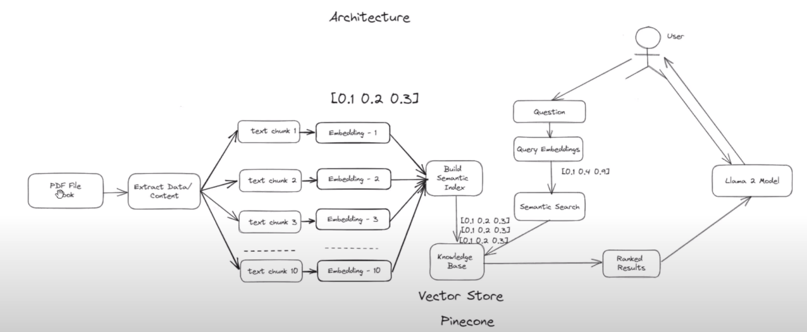
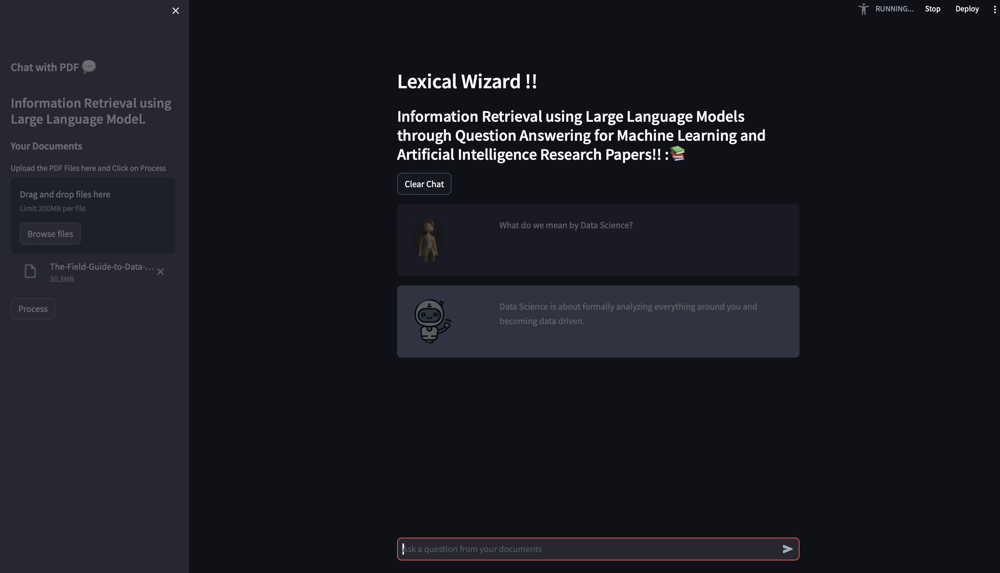

# Lexical Wizards
## _Your Streamlit Question-Answering App_
Lexical Wizards is a Streamlit application that utilizes language models for question answering on a provided research paper about Artificial Intelligence.

- Interact with the assistant in a chat interface
- Get answers based on the content of the research paper
- Easy-to-use, powered by Streamlit

## Team Memebers
1. Amrit Kumar (Captain) - amritk2@illinois.edu
2. Gattu, Sudha Mrudula - sudhamg2@illinois.edu 
3. Ishika Awachat, Ishika - awachat2@illinois.edu 
4. Madhavan, Siddharth - sm120@illinois.edu 

## Features

- Import a research paper in PDF format
- Ask questions related to the content
- Assistant provides answers using LangChain and Hugging Face models
- Chat interface for interactive user experience

## Tech Stack

Lexical Wizards uses several technologies:

- [Streamlit](https://streamlit.io/) - Interactive web app framework
- [PyPDF2](https://pypi.org/project/PyPDF2/) - PDF parsing library
- [LangChain](https://pypi.org/project/langchain/) - Question answering and language processing library
- [Hugging Face Transformers](https://huggingface.co/models) - Pre-trained language models
- [Altair](https://altair-viz.github.io/) - Declarative statistical visualization library
- [Unstructured](https://pypi.org/project/unstructured/) - Open-source components for ingesting and pre-processing images
- [Sentence Transformers](https://pypi.org/project/sentence-transformers/) - Compute dense vector representations
- [Pinecone Client](https://pypi.org/project/pinecone-client/) - Pinecone python client
- [Llama C++ Python](https://pypi.org/project/llama-cpp-python/) - Python Bindings for llama.cpp
- [Pandas](https://pandas.pydata.org/) - Data manipulation and analysis library

## System Design/Architecture

- This Large Language Model powered application is intended to perform information retrieval from the loaded document/web and provide personalized answers to user questions through a chat window.
- We are intending to use LLAMA2 (large language model) for the implementation.
- Below is the system design for the LexicalWizard application.

### Flow:

#### Preprocessing

- The data (PDF/Web Data) for a specific domain will be loaded.
- Data from the source will be extracted and split.
- Split data (chunks) will be converted into embeddings.
- Embeddings will be saved into an Indexed Vector Database i.e., Pinecone.
- Indexed Vector Store will be acting as a “Knowledge Base” to answer user queries.

#### Answering User Queries

- When a user posts his/her question, embeddings will be created for the provided query.
- Similarity search will be performed in the Pinecone vector store using the query embeddings.
- Similarity Search will return TOP RANKED chunks from the index vector store.
- The ranked results will be sent to the LLAMA2 model along with the user/system prompts to answer the asked queries.
- Answers from the LLAMA2 model will be displayed in the chat window as an answer.
- For further questions, previous chat conversations will be passed as context to continue the conversation.

## Installation

To run the application locally, follow these steps:

1. **Clone the repository:**

   ```bash
   git clone https://github.com/ishikaawachat/CS410TeamProject.git
   ```
2. **Navigate to the project directory:**
   ```bash
    cd lexical-wizards
   ```
3. **Install the required Python packages:**
   ```bash
    pip install -r requirements.txt
   ```
4. **Set up Streamlit secrets:**
- Create a .streamlit directory in the project root.
- Create a .secrets.toml file in the .streamlit directory.
- Add your Hugging Face Hub API token:
   ```bash
    API_TOKEN = "your_hugging_face_api_token"
   ```
## Usage
1. Upon running the app, you will see a chat interface
2. Enter your question in the chat input. The assistant will then provide an answer based on the content of the provided research paper.
3. The conversation history is displayed, showing user and assistant messages.
- Below is a screenshot from the LexicalWizard application.
